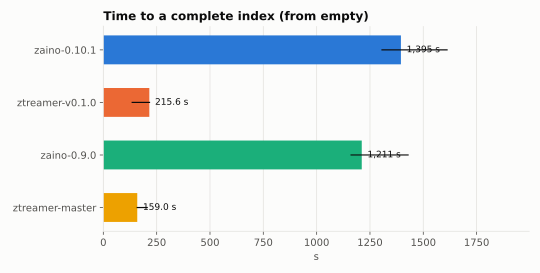
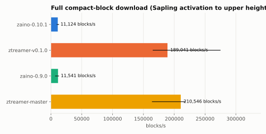

# Zaino vs Ztreamer: an independent compatibility and performance comparison

*Campaign of 2026-10-09/10. All numbers come from the runs in [`runs/`](../runs) (summaries) and the
[raw-data release](https://github.com/pearl-max468/zcash-indexer-bench/releases/tag/results-2026-10-10)
(every per-request sample). Tables are generated by [`bench/report.py`](../bench/report.py) and
[`bench/compare_compat.py`](../bench/compare_compat.py); figures are in [`results/figures/`](../results/figures).*

## Summary

Four builds were measured on identical inputs: Zaino 0.10.1 (latest stable) and 0.9.0, Ztreamer
v0.1.0 (latest tag) and master. Each ran three times from an empty index on free GitHub runners,
against Zcash testnet frozen at height 4,382,897.

**Compatibility.** All four builds implement the lightwallet protocol v0.5.0 and return correct
data: every response that can be checked against Zebra's JSON-RPC (block hashes, transaction
bytes, tree states, subtree roots, address history, UTXOs, balances) matches. Wallets can use
either indexer. The differences found are in conventions and edge cases, not in chain data:

- Zaino 0.9.0's `GetBlock` includes transparent data by default; the protocol says the default is
  shielded-only. Zaino 0.10.1 and both Ztreamer builds follow the protocol, and are byte-identical
  to each other for every block requested.
- `GetSubtreeRoots.completingBlockHash` is in display byte order on Zaino (as lightwalletd sends it)
  and in internal byte order on Ztreamer. The roots and heights agree.
- For bad input or unknown transactions, Zaino returns gRPC `INTERNAL`; Ztreamer returns
  `INVALID_ARGUMENT` or `NOT_FOUND`.
- A duplicated address in `GetTaddressBalanceStream` is counted twice by Zaino and Ztreamer v0.1.0,
  and once by Ztreamer master and by Zebra's `getaddressbalance`.
- On JSON-RPC, Zaino serves three methods Zebra does not (`gettxoutsetinfo`, `getblockdeltas`,
  `getaddressdeltas`); both indexers add `getchaintips`. Zaino's `getrawtransaction` with verbosity 0 returns the verbose object instead of a hex
  string, and three `getblock` fields are byte-reversed relative to Zebra. Ztreamer's JSON-RPC (its
  embedded Zakura node) matches Zebra except for one funding-stream label and Ironwood fields.

**Index build.** Zaino answers its first gRPC request 6 s after starting, because it passes
requests through to Zebra while it builds its own index. It completes the index in
1,160–1,610 s. Ztreamer answers once its index is complete, after 135–216 s. On the same runner CPU,
Zaino 0.10.1 took 6.0–6.5× as long as Ztreamer v0.1.0 and used 7.5–8× the CPU time (Zebra
included). Across all runs it wrote 3.7× as many bytes, and its index is 15× larger on disk
(22.1 vs 1.44 GiB).

**Serving.** Ztreamer is faster in every serving scenario measured. Bulk compact-block streaming,
which dominates wallet sync, shows the largest gap: 13–17× more blocks per second for a full
wallet download, depending on runner. With 128 concurrent clients the gap narrows to about 2×
(both servers were limited to two CPU cores).

**One cause of Zaino's latency is a socket option, not indexing work.** Six of twelve Zaino RPCs
have a median latency of about 40 ms, and every Zaino RPC has a 99th percentile of about 41 ms.
Zaino builds its listener in a way that tonic documents as ignoring `TCP_NODELAY`, so Nagle's
algorithm combines with the client's delayed ACKs. Setting the option externally, with the binary
unchanged, removed the 40 ms floor: `GetTreeState` p50 went from 40.3 to 0.75 ms (Ztreamer: 0.63 ms)
and single-client `GetBlock` from 135 to 2,817 requests/s. Bulk streaming was unaffected, so the
throughput gap above stands. The same run on Ztreamer, which already sets the option, changed
nothing. The 43.3 ms Zaino `GetBlock` median in Ztreamer's own published comparison is consistent
with this floor.

**Versions.** On the same CPU (EPYC 7763), Zaino 0.9.0 and 0.10.1 build the index within 10% of
each other, and Ztreamer master and v0.1.0 serve within 1% of each other. On Xeon 8573C runners,
master's two runs streamed 13–15% faster than v0.1.0's one run. Three runs per build cannot settle
whether that is a real change. Most of the spread in the all-runner medians comes from which CPU
each job landed on.

## What was compared

| Build | Commit | Backing node | Why |
|---|---|---|---|
| Zaino 0.10.1 | `3244a74` | Zebra 6.4.2, `direct` backend | Latest stable Zaino release (2026-09-29) |
| Zaino 0.9.0 | `d27ec93` | Zebra 6.4.2, `direct` backend | The build Ztreamer's published comparison (2026-09-11) measured |
| Ztreamer v0.1.0 | `c40f3c3` | Embedded Zakura (fork `f4d44dd`, state format 28.1.5) | Latest Ztreamer tag (2026-09-12) |
| Ztreamer master | `6232ae0` | Embedded Zakura 1.5.1 (state format 29.1.0) | What Ztreamer's README install command builds |

Both indexers serve the same lightwallet gRPC protocol: each vendors `zcash/lightwallet-protocol`
v0.5.0 unchanged. They differ in architecture:

- **Zaino** is a separate process beside a Zebra full node. In `direct` mode it reads Zebra's state
  database on the same host and uses Zebra's JSON-RPC for what the database cannot answer (mempool,
  passthrough RPCs). It keeps its own LMDB index.
- **Ztreamer** embeds a Zakura node (a Zebra fork) in the same process and keeps an LMDB compact-block
  index. Its JSON-RPC surface is the embedded Zakura node's RPC.

Z3's compose file still pins `zainod:0.6.0`, and the public Zaino endpoint `zaino.unsafe.zec.rocks`
reports 0.6.0. This comparison uses the current releases.

## Method

**Data.** Every node starts from the same Zcash Foundation testnet snapshot
(`zebrad-state-testnet-v28-20260923.tar.zst`, SHA-256 `e1702bb2…8636`) and stays frozen at its tip,
height 4,382,897. Zebra runs with no outbound peers and no peer cache. Ztreamer's embedded Zakura
node peers only with that Zebra, so it sees itself at the tip and receives nothing newer. Every run
must end serving exactly that tip, or it is rejected. The snapshot predates testnet's NU7
activation, so every build follows the same consensus rules. Neither project produced the data.

**Hardware.** Free GitHub-hosted runners (`ubuntu-24.04`, 4 vCPU, 16 GB RAM). The server under test
is pinned to CPUs 0–1 and the load generator to CPUs 2–3. Each job records the runner's CPU model,
memory, kernel and disk. Runners came with five different CPU models, so every table below that
compares absolute speed also has a same-CPU view.

**Fairness rules.**
1. Each project runs as its documentation recommends; default settings unless required to run.
2. One system per job: nothing else under test runs on the machine.
3. The backing node is at the frozen tip before the clock starts.
4. Every system receives the same requests: seed-derived heights (seed 20261009), the same fixtures,
   the same fixed upper height (4,382,797 = tip − 100).
5. The load generator ([ghz](https://github.com/bojand/ghz) v0.121.0, third-party) runs on CPUs
   separate from the server's; its CPU time is recorded to rule out a client bottleneck.
6. Resource figures come from each process's cgroup (kernel accounting). Zaino's exclude Zebra, which is
   reported separately; Ztreamer's include its embedded node, because they cannot be separated.

**Measurements.**

| Area | What | How |
|---|---|---|
| gRPC compatibility | All 20 lightwallet-protocol methods, 274 cases; identical requests to each system | Responses compared byte-for-byte across systems and checked against Zebra's JSON-RPC |
| JSON-RPC coverage | The 28 methods Zaino 0.10.1 serves (34 cases) | Status and result per system, compared with Zebra where deterministic |
| Index build | From an empty index, cold page cache | Time to first gRPC answer and to a complete index; CPU seconds, peak memory, bytes written; index size |
| Latency | 12 RPCs, 1,000 sequential requests each after 50 warmups | p50 / p95 / p99 |
| Range throughput | `GetBlockRange` of 100 to 100,000 blocks | blocks per second |
| Concurrency | 1, 8, 32, 128 clients, one connection each, 30 s | blocks/s for `GetBlockRange(1,000)`, requests/s for `GetBlock` |
| Wallet download | Sapling activation (280,000) to the upper height in 10,000-block chunks | blocks per second (download only; no trial decryption) |

## Results: compatibility

Full tables: [`results/compat/compat.md`](../results/compat/compat.md); per-case matrix:
[`results/compat/grpc-matrix.csv`](../results/compat/grpc-matrix.csv).

### gRPC

| Method | Cases | Zebra reference checks passed (each build) | Byte-identical across all four |
|---|---:|---|---:|
| GetBlock | 75 | 73/73 | 1/75 (74/75 without Zaino 0.9.0) |
| GetBlockNullifiers | 68 | no reference | 6/68 (all without Zaino 0.9.0) |
| GetBlockRange, GetBlockRangeNullifiers | 18 | 18/18 | 18/18 |
| GetTreeState, GetLatestTreeState | 74 | 73/73 | 74/74 |
| GetTransaction | 6 | 5/5 | 5/6 (error code differs) |
| GetTaddressTxids, GetTaddressTransactions | 6 | 6/6 | 6/6 |
| GetAddressUtxos, GetAddressUtxosStream | 6 | 6/6 | 6/6 |
| GetTaddressBalance | 5 | 4/4 | 4/5 (error code differs) |
| GetTaddressBalanceStream | 4 | 3/4 (Ztreamer master 4/4) | 3/4 |
| GetSubtreeRoots | 5 | 4/4 (root and height) | 0/5 (hash byte order) |
| GetLatestBlock, GetMempoolTx | 2 | – | 2/2 |
| GetLightdInfo | 1 | – | 0/1 (identity fields) |
| SendTransaction | 2 | – | 0/2 (error code differs) |
| Ping, GetMempoolStream | 2 | – | see below |

What differs, and why:

1. **Transparent data in `GetBlock` (Zaino 0.9.0 only).** In 74 of the 75 cases, 0.9.0's compact
   block differs from the other three. It includes transparent-only and coinbase transactions, with
   their `vout`. The protocol
   comment on `GetBlock` says the server "defaults to returning only shielded (Sapling, Orchard, and
   Ironwood) data". Zaino 0.10.1, Ztreamer v0.1.0 and Ztreamer master omit them and are
   byte-identical to each other on every one of the 75 `GetBlock` cases. `GetBlockNullifiers`
   differs in the same way. Wallets ignore the extra entries, so they cost bandwidth, not
   correctness.
2. **`GetSubtreeRoots.completingBlockHash` byte order.** Zaino sends the hash in display order
   (`0012…`), as lightwalletd does (`hash32.ReverseSlice(block.Hash)` in its `frontend/service.go`).
   Ztreamer sends it in internal order (`…1200`). The roots and completing heights match Zebra's
   `z_getsubtreesbyindex` on all builds. librustzcash and zingolib do not read this field, so current
   wallets are not affected, but a client that looks up the block by this hash would need to handle both.
3. **Error codes.** For malformed or already-mined transactions and invalid addresses, Zaino returns
   `INTERNAL` with the node's message embedded; Ztreamer returns `INVALID_ARGUMENT`. For an unknown
   txid, Zaino returns `INTERNAL` (wrapping Zebra's `-5`) and Ztreamer returns `NOT_FOUND`. Clients
   that retry on `INTERNAL` will retry requests that cannot succeed.
4. **Duplicate addresses in `GetTaddressBalanceStream`.** Sending the three fixture addresses plus
   one repeat: Zaino 0.10.1, Zaino 0.9.0 and Ztreamer v0.1.0 return 870,875,041,300 zat, counting the
   repeated address (51,750,020,650 zat) twice. Ztreamer master returns 819,125,020,650 zat, as does
   Zebra's `getaddressbalance` for the same addresses. The protocol does not define duplicate
   handling; the reference check here assumes set semantics.
5. **`GetLightdInfo`.** Ztreamer leaves `upgradeName`, `upgradeHeight`, `gitCommit`, `branch` and
   `buildDate` empty and reports `estimatedHeight` equal to its tip. Zaino fills them in (`NU6.3`,
   4,134,000) and takes `estimatedHeight` from Zebra's clock-based estimate.
6. **`Ping`** is `UNIMPLEMENTED` on both (Ztreamer enables it with `--ping-very-insecure`).
   **`GetMempoolStream`** stays open until the next block on all four builds; on a frozen chain that
   never arrives, so the 5-second test window ends with `DEADLINE_EXCEEDED` everywhere, as expected.

### JSON-RPC

Ztreamer's JSON-RPC is its embedded Zakura node, so this compares Zaino's own JSON-RPC layer with a
Zebra fork's. Compared with Zebra 6.4.2 (results equal unless listed):

| | Zaino 0.10.1 | Zaino 0.9.0 | Ztreamer (both) |
|---|---|---|---|
| Extra methods (Zebra: method not found) | `gettxoutsetinfo`, `getblockdeltas`, `getaddressdeltas`, `getchaintips` | same, without `getaddressdeltas` | `getchaintips` |
| `getrawtransaction` verbosity 0 | the verbose transaction object instead of a hex string | same | equal |
| `getrawtransaction` verbosity 1 | equal | `time`, `blocktime` missing | equal |
| `getblock` verbosity 1/2 | `blockcommitments`, `finalsaplingroot`, `nonce` byte-reversed | same | equal |
| `getblock` verbosity 2, `tx[].ironwood` | `anchor` byte-reversed | same | `anchor` byte-reversed; extra `flags.enableCrossAddress` |
| `z_gettreestate` | equal | Orchard and Ironwood `finalRoot` byte-reversed | equal |
| `z_validateaddress` | `ismine` missing, `type` added | same | equal |
| `gettxout` | `version` missing | same | equal |
| `getblocksubsidy` | equal | equal | funding stream labelled "Major Grants" / ZIP-214 instead of "Zcash Community Grants NU6" / ZIP-1015; amounts equal |
| `sendrawtransaction` (already mined) | error `-8` wrapping the node's `-25` | same | `-25` |
| `getspentinfo` | `-1` internal error | same | method not found (as Zebra) |

`getrawtransaction` with verbosity 0 is the one likely to break existing callers: zcashd and Zebra
both return a bare hex string there.

## Results: initial index build

Medians of three runs (min–max in [`results/index-summary.csv`](../results/index-summary.csv)):

| Build | Time to complete | First gRPC answer | Indexer CPU-s | + Zebra CPU-s | Peak heap | Peak RSS | Written | Index on disk |
|---|---:|---:|---:|---:|---:|---:|---:|---:|
| Zaino 0.10.1 | 1,395 s | 6 s | 2,279 | 218 | 1.65 GiB | 9.18 GiB | 39.05 GiB | 22.06 GiB |
| Zaino 0.9.0 | 1,211 s | 6 s | 1,627 | 117 | 1.60 GiB | 8.95 GiB | 39.05 GiB | 22.06 GiB |
| Ztreamer v0.1.0 | 216 s | 210 s | 256 | (embedded) | 0.75 GiB | 1.42 GiB | 10.56 GiB | 1.44 GiB |
| Ztreamer master | 159 s | 158 s | 208 | (embedded) | 0.77 GiB | 1.45 GiB | 8.18 GiB | 1.44 GiB |

Heap is the cgroup's peak anonymous memory. RSS is the process's high-water mark, which also counts
memory-mapped index pages. Ztreamer's figures include its embedded node.

Same CPU (AMD EPYC 7763, the only model all four builds ran on): Zaino 0.10.1 1,306 and 1,395 s,
Zaino 0.9.0 1,429 s, Ztreamer v0.1.0 216 s, Ztreamer master 206 s. CPU seconds on that model:
Zaino 0.10.1 2,496–2,696 including Zebra, Ztreamer v0.1.0 331. All per-run values with their CPU:
[`results/index-runs.csv`](../results/index-runs.csv).

How to read this:
- **Zaino is usable immediately.** While its index builds, it answers through Zebra
  (5.9–6.0 s to the first `GetBlock` at the tip in every run). Zaino 0.10.1's own sync reached its
  target after 1,248–1,527 s. The remaining 55–82 s is its accumulator catching up before the
  persistent database comes back online. The run counts as complete when Zaino logs "finalised
  state switched back to the persistent database".
- **Ztreamer serves nothing until its index is complete.** On these runs that took 135–216 s.
  Roughly half of it is the embedded node opening its state, which includes a check of its
  spending-transaction index, and reporting that it is near the tip (63–123 s). Building the
  compact-block index takes the rest.



## Results: serving

Medians of three runs: [`results/results.md`](../results/results.md). Figures: latency, range
throughput, concurrency and wallet download in [`results/figures/`](../results/figures).

### Latency (p50 / p99 ms, 1,000 sequential requests)

| RPC | Zaino 0.10.1 | Ztreamer v0.1.0 | Zaino 0.9.0 | Ztreamer master |
|---|---:|---:|---:|---:|
| GetLightdInfo | 2.47 / 41.1 | 0.10 / 0.40 | 2.39 / 41.3 | 0.08 / 0.35 |
| GetLatestBlock | 0.16 / 41.1 | 0.09 / 0.37 | 0.15 / 41.2 | 0.07 / 0.30 |
| GetBlock | 0.65 / 41.4 | 0.16 / 0.57 | 2.06 / 41.3 | 0.15 / 0.49 |
| GetBlockNullifiers | 0.26 / 41.3 | 0.16 / 0.52 | 0.27 / 41.3 | 0.15 / 0.44 |
| GetTreeState | 40.4 / 41.4 | 0.61 / 1.15 | 40.3 / 41.3 | 0.52 / 1.11 |
| GetLatestTreeState | 40.3 / 41.3 | 0.31 / 0.67 | 40.3 / 41.3 | 0.28 / 0.61 |
| GetSubtreeRoots sapling (10) | 40.8 / 41.6 | 0.33 / 0.81 | 40.9 / 41.6 | 0.29 / 0.61 |
| GetSubtreeRoots orchard (10) | 40.8 / 41.7 | 0.24 / 0.56 | 40.9 / 41.6 | 0.22 / 0.55 |
| GetMempoolTx | 40.8 / 41.5 | 0.20 / 0.51 | 40.9 / 41.5 | 0.18 / 0.47 |
| GetTransaction | 2.07 / 41.3 | 0.22 / 0.62 | 2.70 / 41.3 | 0.20 / 0.55 |
| GetTaddressBalance | 0.30 / 41.2 | 0.19 / 0.50 | 0.30 / 41.2 | 0.17 / 0.44 |
| GetAddressUtxos (35,000-entry address) | 41.4 / 520 | 3.23 / 425 | 41.2 / 373 | 2.92 / 398 |

### Throughput

| Scenario | Zaino 0.10.1 | Ztreamer v0.1.0 | Zaino 0.9.0 | Ztreamer master |
|---|---:|---:|---:|---:|
| GetBlockRange 100 blocks | 2,359 | 107,249 | 2,208 | 121,196 |
| GetBlockRange 1,000 blocks | 11,414 | 179,486 | 10,803 | 202,122 |
| GetBlockRange 10,000 blocks | 24,571 | 169,014 | 29,095 | 181,558 |
| GetBlockRange 100,000 blocks | 11,576 | 181,685 | 11,610 | 203,677 |
| Wallet download 280,000 → 4,382,797 | 11,124 | 189,041 | 11,541 | 210,546 |
| GetBlockRange(1,000), 8 clients | 55,835 | 232,419 | 56,035 | 259,128 |
| GetBlockRange(1,000), 128 clients | 110,093 | 229,527 | 145,235 | 259,498 |
| GetBlock, 1 client (req/s) | 132 | 3,997 | 58 | 4,422 |
| GetBlock, 128 clients (req/s) | 6,843 | 11,044 | 5,528 | 12,067 |

Blocks per second unless marked. Same CPU (EPYC 7763), medians of the runs on that model:

| Scenario | Zaino 0.10.1 | Ztreamer v0.1.0 | Zaino 0.9.0 | Ztreamer master |
|---|---:|---:|---:|---:|
| GetBlock p50 / p99 (ms) | 0.64 / 41.3 | 0.24 / 0.73 | 1.79 / 41.3 | 0.24 / 0.63 |
| GetBlockRange 1,000 blocks | 11,737 | 151,032 | 11,714 | 151,739 |
| Wallet download | 11,943 | 165,602 | 12,761 | 164,343 |
| GetBlockRange(1,000), 128 clients | 115,197 | 200,552 | 145,235 | 198,711 |
| GetBlock, 128 clients (req/s) | 6,478 | 9,579 | 4,942 | 9,689 |

Ztreamer master and v0.1.0 are within 1% of each other on the EPYC 7763. On Xeon 8573C, master's
two runs reached 202k and 207k blocks/s on `GetBlockRange(1,000)` against 179k for v0.1.0's one
run there. v0.1.0's fastest run (281k) was on an EPYC 9V45, a model master did not get.

Zaino's single-stream `GetBlockRange(1,000)` latency is bimodal. Its median moved between 14 and
179 ms across runs while the mean stayed between 81 and 115 ms, so throughput (mean-based) is the
figure to compare.



## The 40 ms floor: TCP_NODELAY

Zaino's latency table has two regimes: some requests finish in well under a millisecond, and many
take 40–42 ms. The 40 ms value is the interaction of Nagle's algorithm on the server's socket with
delayed ACKs on the client. A response written as more than one small segment waits for an ACK
that the client delays by up to 40 ms.

Code (both projects use tonic 0.14.6):
- Zaino ([`zaino-serve/src/server/grpc.rs`](https://github.com/zingolabs/zaino/blob/3244a74bb09fa6a09a4b2deeb6be53bab0890747/packages/zaino-serve/src/server/grpc.rs#L50),
  lines 50 and 103–118 at 0.10.1) binds `TcpIncoming::bind(addr)` itself and passes it to
  `Server::builder()…serve_with_incoming_shutdown`. `TcpIncoming::bind` sets `nodelay: None`, and
  tonic documents that "the `tcp_nodelay` and `tcp_keepalive` settings are ignored when using this
  method". Accepted sockets therefore keep Nagle on.
- Ztreamer (`bin/ztreamerd/src/main.rs:298`) calls `serve_with_shutdown(addr, …)`, which binds through
  tonic's `bind_incoming` and applies `with_nodelay(Some(true))` (tonic's default).

To test this without changing either binary, the harness can preload a 30-line shim
([`ci/nodelay.c`](../ci/nodelay.c)) that sets `TCP_NODELAY` on every accepted socket (workflow input
`tcp_nodelay`). One run of each, same CPU model as the default runs it is compared with. Full
table: [`results/diagnostic-tcp-nodelay.md`](../results/diagnostic-tcp-nodelay.md).

| Zaino 0.10.1 (EPYC 7763) | p50 default → shim (ms) | mean default → shim (ms) | throughput default → shim |
|---|---:|---:|---:|
| GetTreeState | 40.3 → 0.75 | 21.9 → 0.79 | 43 → 1,027 req/s |
| GetMempoolTx | 40.8 → 0.20 | 40.8 → 0.22 | 23 → 2,771 req/s |
| GetSubtreeRoots orchard (10) | 41.3 → 6.2 | 41.2 → 6.3 | 23 → 149 req/s |
| GetSubtreeRoots sapling (10) | 40.8 → 30.0 | 41.9 → 30.2 | 23 → 31 req/s |
| GetBlock, 1 client | 0.30 → 0.23 | 7.2 → 0.25 | 135 → 2,817 req/s |
| GetBlock, 128 clients | 4.6 → 8.3 | 19.0 → 10.0 | 6,478 → 9,414 req/s |
| GetBlockRange 100 blocks | 41.8 → 2.6 | 41.9 → 9.4 | 2,366 → 10,375 blocks/s |
| GetBlockRange 1,000 blocks | 37.4 → 146.1 | 83.5 → 99.0 | 11,737 → 9,965 blocks/s |
| GetBlockRange(1,000), 32 clients | 192.9 → 195.0 | 287.8 → 454.0 | 108,417 → 68,743 blocks/s |
| Wallet download | 755.7 → 773.9 | 839.5 → 808.4 | 11,943 → 12,343 blocks/s |

- With the shim, these Zaino RPCs come within 1.2× of Ztreamer's p50 on the same CPU, or beat it:
  `GetLatestBlock`, `GetBlockNullifiers`, `GetTreeState`, `GetLatestTreeState`, `GetMempoolTx`,
  `GetTaddressBalance` and single-client `GetBlock`. The gaps that remain are work the server
  does: `GetSubtreeRoots` (sapling 30.1 vs 0.49 ms, orchard 6.2 vs 0.37 ms), `GetLightdInfo` (2.45
  vs 0.16 ms), `GetTransaction` (0.90 vs 0.32 ms), and `GetBlock` at random heights (mean 0.71 vs
  0.27 ms).
- Bulk streaming did not improve. On a single `GetBlockRange(1,000)` stream the shim run (9,965
  blocks/s) is inside the three default runs' range (9,030–12,060). With 8 and 32 clients it is
  below that range (32 clients: 68,743 against 77,922–113,062 blocks/s). One run cannot separate that from noise, but it shows no gain, so the
  13–17× streaming gap is not a socket artefact.
- Ztreamer v0.1.0 with the same shim changed by less than 3% in every scenario. That rules out a
  cost from the shim itself.

A fix in Zaino would be one line: `TcpIncoming::bind(addr)?.with_nodelay(Some(true))`. No Zaino
issue about this was found as of 2026-10-10.

## Comparison with Ztreamer's published numbers

Ztreamer publishes its own comparison at [ztreamer.sh/benchmarks.html](https://ztreamer.sh/benchmarks.html):
mainnet, an AMD Ryzen 9 9950X3D, one run per figure, Zaino 0.9.0 (`d27ec93`). Its serving figures
for "v0.1.0" come from commit `86bf4b0` plus a fix (labelled `86bf4b0-limit16`), not from the tag.

| Metric | Published (mainnet) Ztreamer vs Zaino | This study (testnet) Ztreamer v0.1.0 vs Zaino 0.9.0 |
|---|---|---|
| Ready to serve | 167 s vs 13,380 s (80×) | 216 s vs 1,211 s to complete (5.6×); Zaino's first answer at 6 s |
| Indexer CPU | 374 s vs 24,506 s | 256 s vs 1,627 s (+117 s Zebra) |
| Zaino peak RSS / bytes written | 47 GB / 247 GB | 8.95 GiB / 39.05 GiB |
| GetBlock p50 | 41 µs vs 43.3 ms | 0.16 ms vs 2.06 ms (p99 0.57 vs 41.3 ms) |
| GetBlockRange(1,000) | 142.6k vs 6.1k blocks/s (23×) | 179.5k vs 10.8k (17×) |
| Wallet download | 134.8k vs 8.6k blocks/s (16×) | 189.0k vs 11.5k (16×) |
| Concurrent ranges, 128 clients | 1.215M vs 265k blocks/s (`GetBlockRange(10,000)`, 4.6×) | 229.5k vs 145.2k (`GetBlockRange(1,000)`, 1.6×), server on 2 cores |

The direction of every published result holds. The streaming ratios are close (16–17× here vs
16–23× published). The index-build ratio is far smaller on testnet, and this study cannot say how
much of the published 80× comes from mainnet's size and sandblasting-era blocks. The mainnet
scripts in this repository can answer that on dedicated hardware. The published 43.3 ms Zaino
`GetBlock` median matches the Nagle floor described above, so most of the ~1,000× latency gap
published for that RPC would close with a socket option.

## Harness issues found and fixed during the campaign

Reported for transparency; no data from a defective run is used.

- **Zaino completion.** Zaino 0.10.1's height metrics reach the sync target before its txout-set
  accumulator is committed, and 0.9.0 exports no height metrics. The first campaign's Zaino jobs
  (run 37871834309) waited on the metrics and timed out. Since `f6c2ad1`, a Zaino run is complete
  when Zaino logs "finalised state switched back to the persistent database", the same rule for
  both versions.
- **Ztreamer master reaching outside peers.** Zakura 1.5.1 starts its experimental iroh P2P v2 stack
  with built-in bootstrap peers on testnet by default. In the first master runs the embedded node
  synced past the frozen tip, so it indexed a different chain. Since `2f1306e`, frozen mode pins
  `network.p2p_stack = "legacy"` for master, and any run that does not end serving the frozen tip is
  rejected (`tip_mismatch`). Ztreamer v0.1.0's fork has no iroh stack, and its config is unchanged.
- **Provenance.** Ztreamer v0.1.0's runs come from run 37871834309 (harness `0064fc5`). Later harness
  changes touch only Zaino's completion rule, serving readiness for Zaino, and master's config. All
  three v0.1.0 runs ended serving the frozen tip. See [`runs/README.md`](../runs/README.md).

## Limitations

- **Testnet, not mainnet.** Testnet blocks are smaller than mainnet's and include no
  sandblasting-era blocks. Absolute times, sizes and memory are therefore not mainnet figures;
  the comparison is relative, on identical inputs. Compatibility findings carry over, because the
  code paths are the same.
- **Shared CI machines.** Runners had five CPU models (EPYC 7763, 9V74, 9V45; Xeon Platinum 8573C,
  Xeon 6973P-C). Same-CPU views are given for the headline figures. Three runs per build is enough to
  show the large gaps here, not to resolve differences of a few percent.
- **Two server cores.** On a 4-vCPU runner the server gets two cores and the client two. Concurrency
  results are CPU-bound and do not show how either indexer scales on larger machines.
- **Different node implementations.** Zaino's node is Zebra; Ztreamer's is Zakura. Each is what its
  indexer is built for, but node-level differences are part of every end-to-end figure.
- **Frozen chain, so not measured:** reorgs, live tip-following, mempool load, TLS overhead, and
  wallet-side scanning. Two open Zaino issues fall in this gap and are worth tracking for mainnet use:
  [#1537](https://github.com/zingolabs/zaino/issues/1537) (streaming RPCs time out on total duration,
  breaking long wallet syncs) and [#1491](https://github.com/zingolabs/zaino/issues/1491) (`direct`
  backend stops advancing after the initial sync). Neither could be triggered here. The longest
  stream measured (100,000 blocks) took up to 21 s on Zaino and never timed out; a single
  full-chain request was not tested. The chain never advances.
- **One diagnostic run each** for the `TCP_NODELAY` test.

## Reproduce

Fork <https://github.com/pearl-max468/zcash-indexer-bench>, run the `bench` workflow (inputs: systems,
repeats, suites, optional `tcp_nodelay`), download the `run-*` artifacts into `runs/` and run:

```sh
python bench/compare_compat.py --runs runs --out results/compat
python bench/report.py --runs runs --out results
python bench/compare_runs.py --run runs-diagnostic/zaino-0.10.1-r1-nodelay \
    --run runs-diagnostic/ztreamer-v0.1.0-r1-nodelay --baseline runs --out results/diagnostic-tcp-nodelay.md
```

The committed `runs/` already reproduces every table in this report. The same scripts run on mainnet
given dedicated hardware (see the README).
